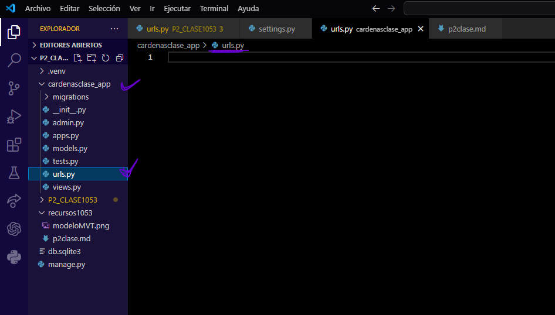
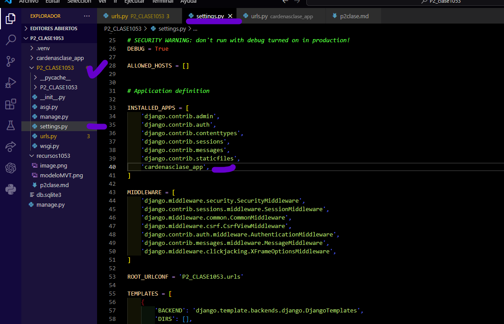
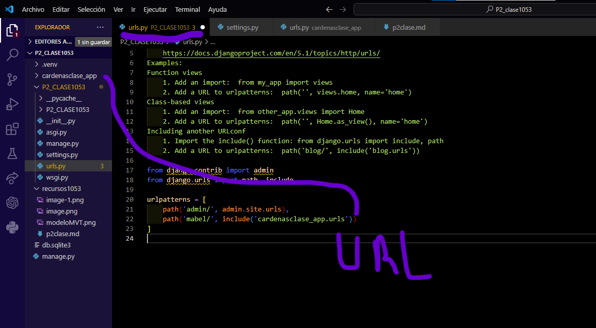
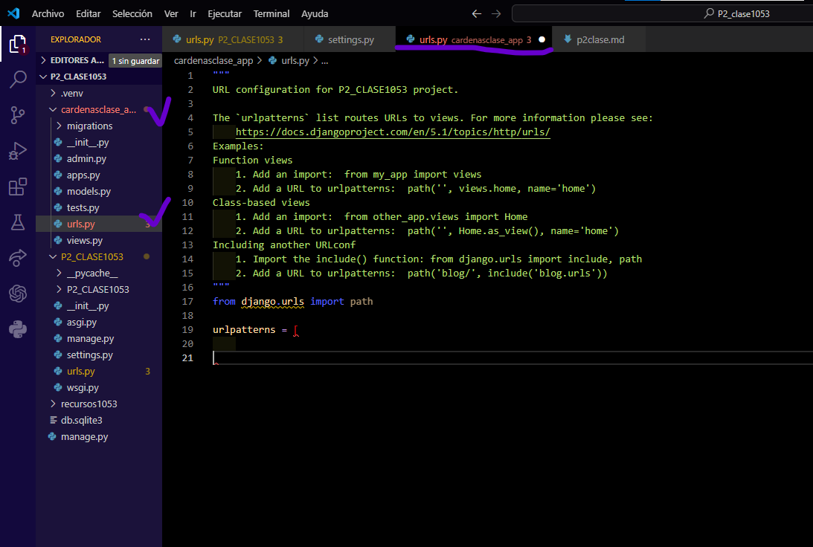
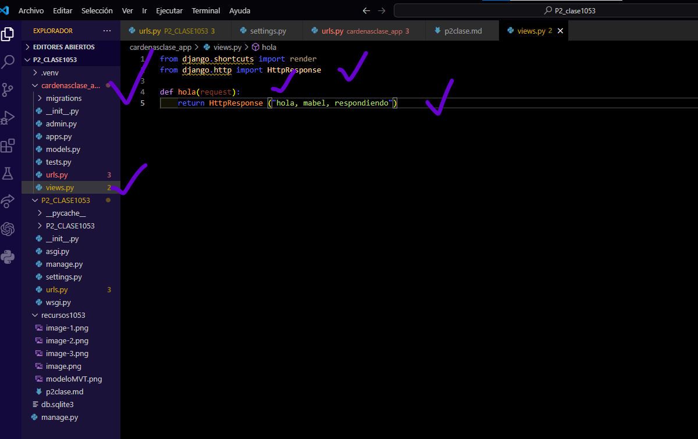
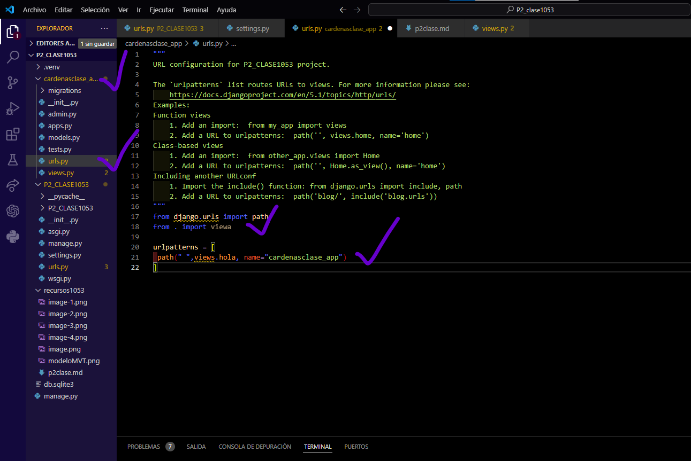

-  Crear aplicacion cardenasclase_app
-  comando --> python manage.py startapp cardenasclase_app
-  creamos el archivo urls.py en cardenasclase
-  
-  en senttings.py de P2_CLASE1053
-  
-  en urls.py de P2_CLASE1053
-  
-  en urlys.py en cardenasclase_app
-  
-  en viewa.py en cardenasclase_app
-  
-  en urls.py en cardenasclase_app
-  